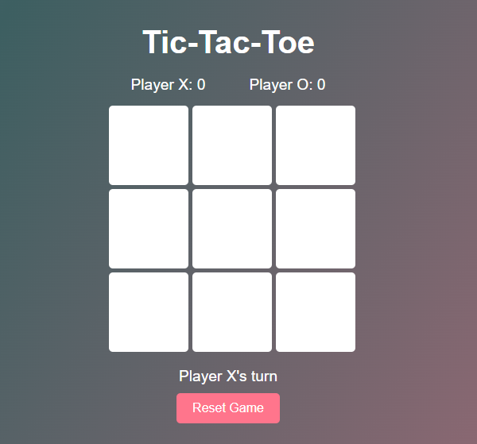
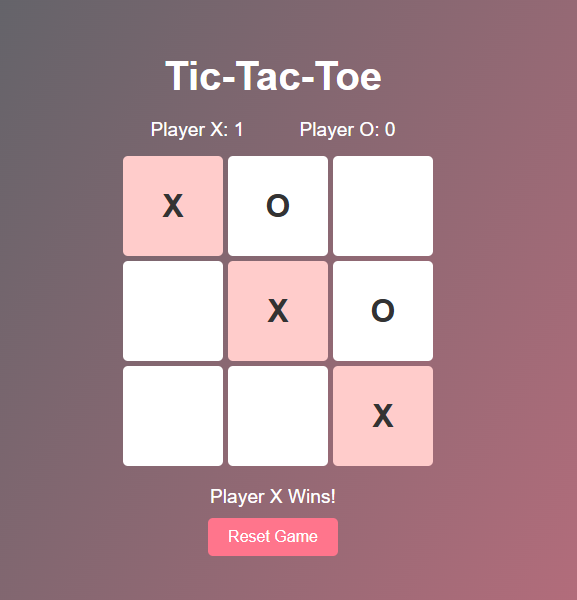
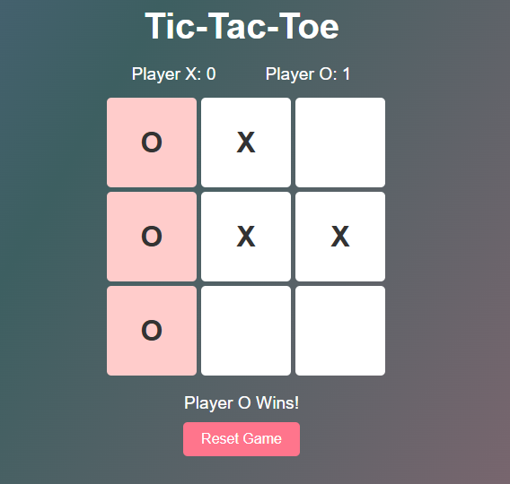

# Tic-Tac-Toe Web Application 🎮

A fully interactive and engaging Tic-Tac-Toe game built with **HTML**, **CSS**, and **JavaScript**. Players can compete against each other or test their skills against an AI opponent. The objective is simple: get three of your markers in a row (horizontally, vertically, or diagonally) to win the game!

## Features ✨
- **Two-player mode:** Play with a friend on the same device.
- **AI opponent:** Challenge yourself by playing against a computer.
- **Dynamic game state:** Real-time updates and highlights for winning moves.
- **Responsive design:** Works smoothly on desktop and mobile devices.
- **Reset functionality:** Restart the game anytime without reloading the page.

## Tech Stack 🛠️
- **HTML:** Structure of the game interface.
- **CSS:** Styling for a clean and visually appealing design.
- **JavaScript:** Game logic, user interactions, and AI implementation.

## How to Play 🚀
1. Open the game in your browser.
2. Choose whether you want to play against a friend or the AI.
3. Players take turns clicking on empty cells to place their markers (X or O).
4. The first player to get three in a row (horizontally, vertically, or diagonally) wins.
5. If all cells are filled without a winner, the game ends in a draw.
6. Click the **Reset** button to start a new game.


## Installation and Usage 🚀

1. Clone the repository:
   ```bash
   git clone https://github.com/CornHaki/PRODIGY_WD_03.git
2. Navigate to the project directory:
   ```bash
   cd PRODIGY_WD_03
3. Open the <code>index.html</code> file in your browser:
   ```bash
   open index.html
---

## Screenshots 📸



---

## 📂 Folder Structure
```plaintext
PRODIGY_WD_03/
├── assets/
│      ├── image1.png
│      ├── image2.png
│      └── image3.css 
├── README.md           # Project description and details
├── index.html          # Main HTML file
├── script.js           # JavaScript file for API integration and functionality
└── styles.css          # CSS file for styling
```

## Author 🖋️
Dimpal Baishya
---

## *📬 Contact Me*
Feel free to connect with me:

📧 Email: baishyadimpal31@gmail.com
---
